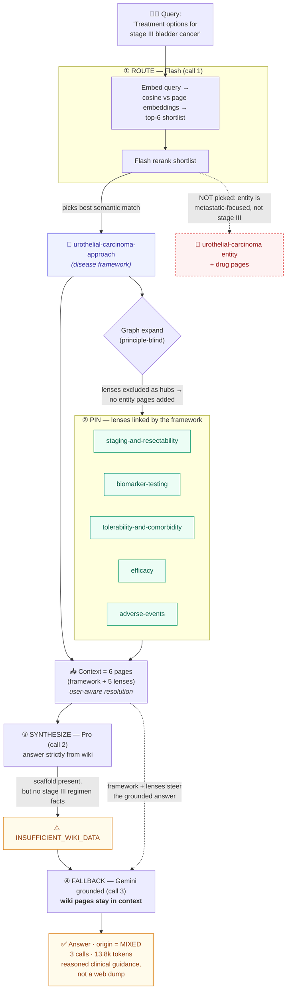

# Retrieval flow — how a query becomes an answer

System documentation (not clinical content). It traces how the app routes a
question, pins the reasoning lenses, and falls back to grounded search — using a
real worked example. See also the principle layer (`wiki/principles/`) and the
link contract in `SCHEMA.md`.

## The pipeline

1. **Route (Flash).** Embed the query, take the top-N most similar pages, and let
   Flash rerank that shortlist. Cheap — only candidate summaries are sent, not the
   whole index.
2. **Graph expand (principle-blind).** Pull in relationally-connected *entity*
   pages via shared hubs, weighted by hub specificity. Principle/lens nodes are
   excluded as hubs and candidates so they never bridge unrelated topics.
3. **Pin lenses.** For every picked page, add the principle nodes it links to
   (efficacy, adverse-events, …). Pinned deterministically — not scored — because
   the most-linked lenses would otherwise be suppressed by anti-hub weighting.
4. **Load (user-aware).** Read the chosen pages. Principle stems resolve to the
   provider's personal fork in `avatar/{user}/principles/` if present, else the
   shared skeleton.
5. **Synthesize (Pro).** Answer strictly from the loaded pages. If they lack the
   specifics, emit `INSUFFICIENT_WIKI_DATA`.
6. **Fallback (grounded).** On insufficiency, run grounded search — but keep the
   wiki pages in context so the lenses steer the grounded answer. Origin becomes
   `mixed`.

## Worked example — "Treatment options for stage III bladder cancer"

Actual run: **origin = mixed · 3 Gemini calls · 13.8k tokens**. The six retrieved
pages were all principle nodes — the disease framework plus the five lenses it
pins — with no entity pages.

## Why this is the design working

- **Division of labor.** The principle layer supplies the *reasoning structure*
  (always reachable, pinned); grounded search supplies the *current specifics*.
  The lenses are why the answer reads as judgment, not a list.
- **Principle-blind expansion** keeps the graph from bridging unrelated topics
  through a high-degree lens like `efficacy`.
- **Growth signal.** Falling back to `mixed` here exposed a real content gap:
  no curative-intent / muscle-invasive urothelial coverage in the wiki. That is
  exactly what the Grow agent should fill so the next such query answers
  wiki-first.
